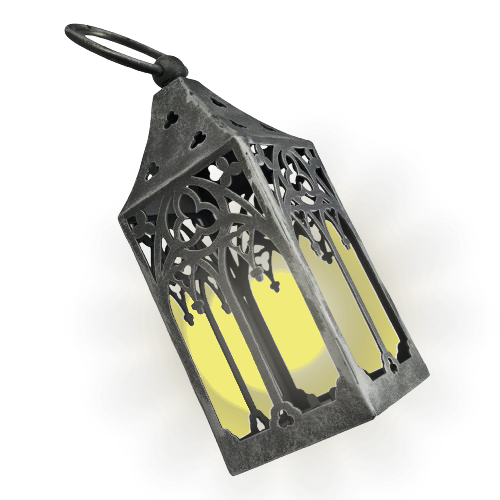
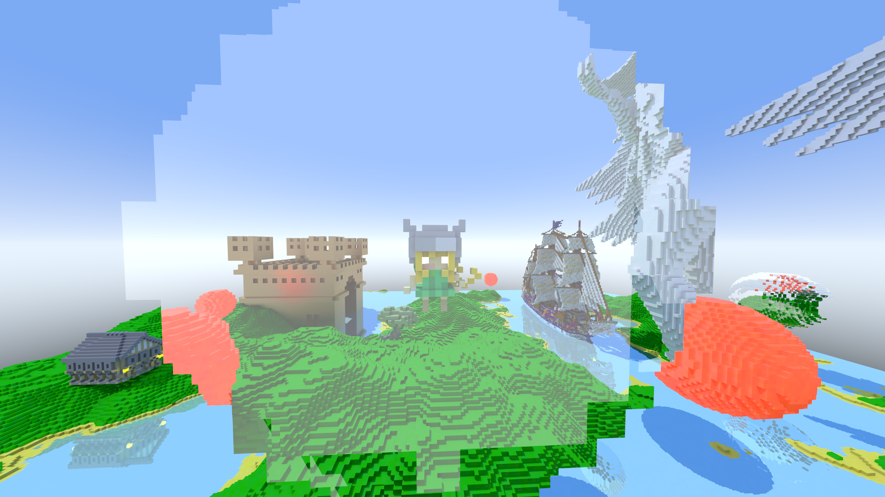
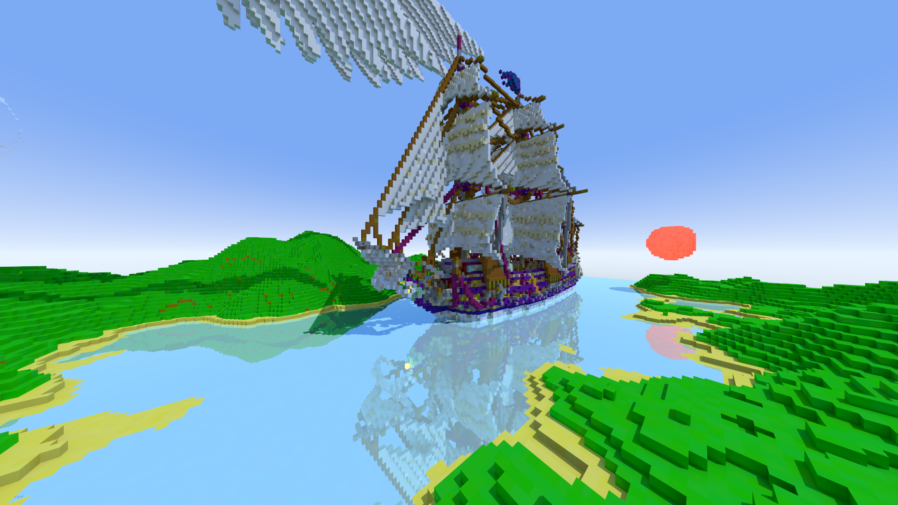
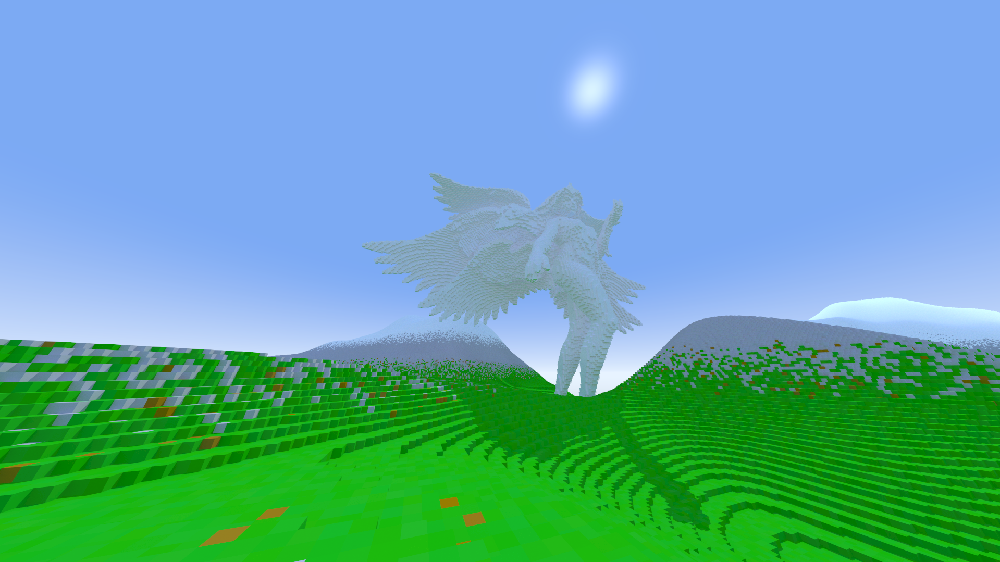
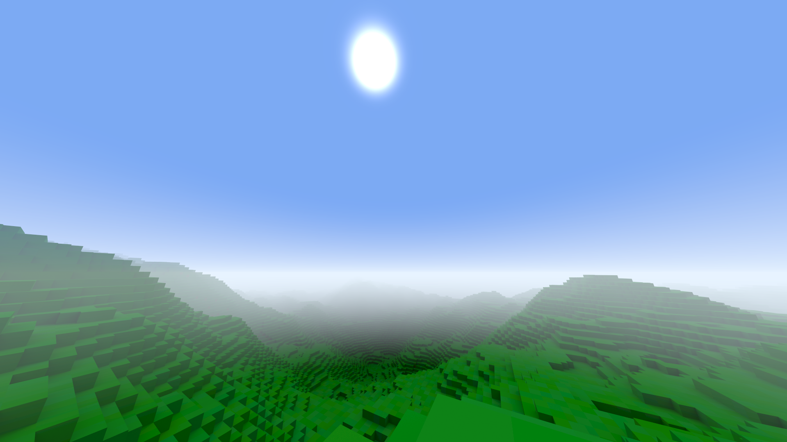
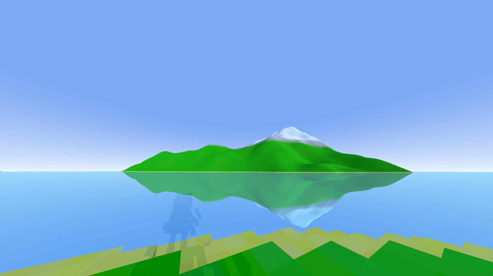
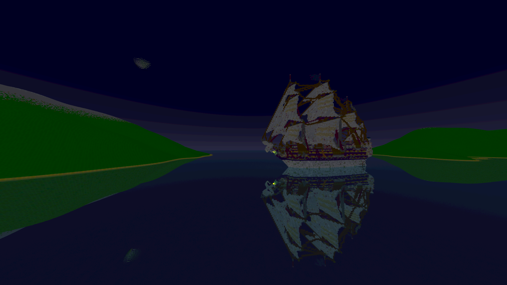

# Lite Ray

This is my sandbox testing enviroment for voxel-based raytracing

  

## Technical Goals

- Path tracing
    - using bitmasking layers for the grid-aligned voxels
        - [Amanatides and Woo traversal](http://www.cse.yorku.ca/~amana/research/grid.pdf)
    - using aabb + transforms into local bittmasked grid-aligned regions for dynamic voxels
    
- Lighting
    - direct lighting (shadow rays for performance)
    - global illumination
    - specular reflections
    - refraction
        - i keep on imagining the invisiblity implemention in halo   

- Chunk loading
    - have around 1 GB of voxel data on the GPU at a time
    - stream chunks in out of this as the player moves around

- Basic terrain generation
    - just stacked noise maps really

- Portals
    - portal visuals are almost free thanks to path tracing

- Models
    - add voxel models to the world

- Networked
    - players stream chunks and other player positions over UDP
    - client side prediction

## Performace Goals

- Run at 100 fps using 720p on my RTX 3050 laptop
- i know this is possible because i can do this with Lay of the Land with RT enabled

## Why

eventually I want to develop a PVP and exploration based SMP game but im writing my own framework in C so this idea is totally unrealistic and will take years

the better reason i just wanted to make a raytracer because it seemed cool

## Screenshots

